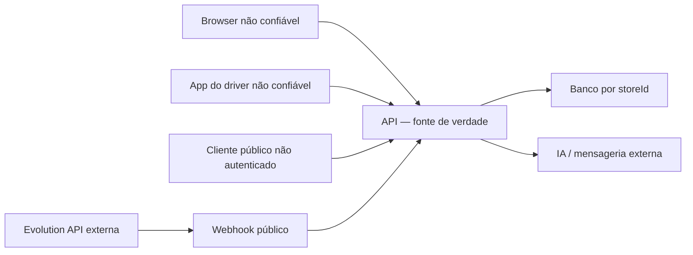

# Auditoria de segurança — Cain Delivery

Data: 14/07/2026  
Base: `a01b2508a0387c99de781f410521208795a90f6a`

## Conclusão

O sistema ainda não deve ser exposto à internet sem correções. Há dois achados críticos: o webhook de WhatsApp aceita eventos sem autenticidade ou proteção contra replay; e o papel `driver` recebe `drivers:view`, permissão compartilhada pelos endpoints administrativos de entregadores, incluindo escrita de localização de qualquer entregador. O smoke test confirmou que um driver autenticado recebe 200 em `GET /drivers` enquanto recebe 403 em `GET /orders`.

A criação convencional de pedidos acerta ao recalcular valores no servidor, mas esse limite de confiança não é uniforme. Repetição de pedido copia preço/pagamento históricos, o token carrega permissões sem revalidação a cada request, mudanças de status não validam transições e não há rate limiting ou idempotência. Nenhuma dessas correções foi misturada ao redesign visual: elas precisam de PRs pequenos, testes de autorização e plano de rollout.

## Modelo de ameaça resumido

Ativos principais:

- dados pessoais de clientes, endereços, telefones e histórico de pedidos;
- localização de entregadores em tempo próximo do real;
- valores, descontos, cupons, caixa e estado de pagamento;
- capacidade de enviar mensagens/acionar IA via WhatsApp;
- isolamento entre lojas e papéis operacionais.

Fronteiras de confiança:

## Achados

| ID | Severidade | Achado | Impacto | Evidência | Correção recomendada |
|---|---|---|---|---|---|
| SEC-01 | Crítica | Webhook WhatsApp sem assinatura, segredo, timestamp ou deduplicação | Evento forjado/repetido pode criar clientes, mensagens e conversas, disparar IA e saída de WhatsApp | `ai-attendant.controller.ts`, rota pública `POST /ai-attendant/whatsapp/webhook` | HMAC sobre corpo bruto, janela de timestamp, nonce/event ID único, allowlist quando viável, rate limit e fila |
| SEC-02 | Crítica | `drivers:view` protege leitura administrativa e `POST /drivers/:id/location` | Driver enumera PII, filas/endereço de outros drivers e pode forjar localização alheia | `drivers.controller.ts`; smoke real: driver → `GET /drivers` 200 | Separar `drivers:self` de `drivers:manage`; `/me/*` usa identidade do token; escrita por `:id` apenas dispatcher/admin |
| SEC-03 | Alta | Token é a fonte das permissões até expirar | Usuário desativado ou papel reduzido preserva acesso; token contém `role`, `permissions` e `storeId` confiados pelos guards | estratégia/guards de auth; somente `/auth/me` consulta membership atual | JWT curto com `sub/session/version`; revalidar membership/loja/papel em cache server-side; revogação/rotação |
| SEC-04 | Alta | Sem rate limiting em login, endpoints públicos e webhooks | Brute force, abuso de catálogo/pedido, custo de IA e DoS | bootstrap/módulos sem limiter | Limites por IP, usuário, loja e rota; backoff; limites mais estritos para login/IA |
| SEC-05 | Alta | Sem idempotência nas mutações financeiras/operacionais | Duplo clique/retry pode duplicar pedido, cupom, caixa ou webhook | criação/repetição/status/webhook sem chave | Chave idempotente por loja/ator/operação, persistida com resultado |
| SEC-06 | Alta | `repeatOrder` reutiliza preço, descontos, total e `paymentStatus` | Bypass de preço/disponibilidade/cupom; novo pedido pode nascer “pago” | `orders.service.ts:repeatOrder` | Reusar apenas intenção de itens; executar pipeline atual de cálculo e pagamento pendente |
| SEC-07 | Alta | Pagamento não-caixa é marcado como pago na criação | Interface/caixa tratam intenção como liquidação sem confirmação | `orders.service.ts`, atribuição `paymentStatus` | Começar pendente; confirmar somente por provedor/webhook assinado ou ação autorizada auditável |
| SEC-08 | Alta | Transições de pedido não são validadas | Usuário com `orders:update`, inclusive cozinha, pode pular/retroceder/cancelar etapas | `orders.service.ts:updateStatus`; payload define status/actor | Máquina de estados por papel, estado atual e pré-condições; ator sempre do contexto autenticado |
| SEC-09 | Alta | Tracking público por UUID expõe entregador | Quem obtém/infere ID recebe nome, telefone e coordenadas do driver | `GET /orders/:id/tracking` público | Token opaco específico do tracking, expiração, minimização/precisão reduzida e rate limit |
| SEC-10 | Alta | Dependências com advisories relevantes | Bypass de validação Fastify; DoS/divulgação no web; `shell-quote` crítico e `undici/ws` altos no driver | `npm audit` nos três projetos | Atualizações patch/minor testadas; trilha separada para salto Expo; CI com audit policy |
| SEC-11 | Média | JWT tem segredo fallback fraco e defaults longos | Deploy mal configurado pode assinar tokens com segredo conhecido por 8h | `.env.example` e configuração auth | Falhar ao iniciar sem segredo forte; 15 min de acesso, refresh rotativo; issuer/audience/alg explícitos |
| SEC-12 | Média | Tokens persistem em storage legível por JavaScript | XSS ou dispositivo comprometido rouba sessão | web `localStorage`; driver `AsyncStorage` | Web: CSP rigorosa e considerar cookie HttpOnly/BFF; mobile: SecureStore/Keychain; rotação |
| SEC-13 | Média | CORS adiciona localhost e aceita qualquer porta local | Política de produção mais ampla que a configuração declarada | bootstrap da API | Ambiente de produção com allowlist exata, sem fallback local; `credentials` apenas se necessário |
| SEC-14 | Média | Ausência de headers defensivos e limite explícito de corpo | Aumenta impacto de XSS/clickjacking/sniffing e DoS por payload | bootstrap sem Helmet/CSP/HSTS/body limit explícito | Helmet compatível, CSP por ambiente, HSTS no edge, Referrer/Permissions Policy e body limits |
| SEC-15 | Média | Respostas Prisma podem incluir `exception.meta` | Metadados de persistência podem revelar nomes de constraints/campos | `AllExceptionsFilter` | Log estruturado interno com correlation ID; resposta pública normalizada sem `meta` bruto |
| SEC-16 | Média | Imagem da Evolution usa tag `latest`; CORS `*` com credenciais | Build externo muda sem revisão e origem é ampla | `infra/evolution-api/docker-compose.yml` | Fixar digest/versão, SBOM/scan; restringir origem e segredos por secret manager |
| SEC-17 | Média | Não existe trilha de auditoria imutável | `actor` é texto do cliente e histórico operacional é insuficiente para investigação | schema não possui `AuditLog`; status recebe actor | Auditoria server-side append-only: ator, loja, alvo, before/after, IP, correlation ID |
| SEC-18 | Baixa | Login exibe/preenche credencial demo e “lembrar” não muda persistência | Facilita uso indevido em deploy e cria falsa expectativa | `LoginPage.tsx`; token sempre vai ao `localStorage` | Demo apenas em ambiente local, campos vazios; implementar semântica real ou remover controle |

## Testes de autorização executados

| Cenário | Esperado | Observado |
|---|---:|---:|
| Sem token em `/orders` | 401 | 401 |
| Credencial inválida | 401 | 401 |
| Owner em `/auth/me` | 200 | 200 |
| Driver em `/orders` | 403 | 403 |
| Driver em `/drivers/me/app-state` | 200 | 200 |
| Driver em `/drivers` | 403 | **200 — falha** |

Ainda devem ser adicionados testes automáticos de matriz papel × recurso × ação, isolamento entre lojas, tokens de usuários desativados, spoof de `storeId`, enumeração de tracking, replay de webhook e concorrência/idempotência.

## Validação e confiança no servidor

### Controles presentes

- A criação normal e pública resolve produtos/opções no banco e recalcula subtotal, taxas, descontos, cupom e total.
- Zod valida a maior parte dos bodies/queries e o `ValidationPipe` global transforma/remove propriedades não previstas.
- O contexto autenticado privilegia `storeId` do token em vez do header do cliente.
- Senhas usam bcrypt e rotas protegidas retornam 401/403 adequadamente nos smoke tests.
- Exceções inesperadas não devolvem stack trace.

### Lacunas

- `forbidNonWhitelisted` não está ativo, então campos extras podem ser silenciosamente descartados em DTOs de classe; padronizar rejeição explícita reduz ambiguidades.
- Preço e disponibilidade não são recalculados em `repeatOrder`.
- O payload de status fornece `actor`, violando a regra de que identidade vem do servidor.
- Não há controle otimista/versionamento para impedir duas equipes de avançarem o mesmo pedido simultaneamente.
- Atualização de pedido, cupom, caixa e disponibilidade do driver pode ocorrer parcialmente por falta de transação.

## Segredos e configuração

Foi feita busca no tree atual e em todo o histórico Git por padrões de chaves privadas, tokens conhecidos e nomes de arquivos sensíveis. Não foram encontrados valores com esses padrões. Há apenas arquivos `.env.example` versionados. O arquivo local da API usado no teste está ignorado e não contém segredo; valores foram injetados no processo.

Isso não substitui scanner dedicado. Recomenda-se `gitleaks`/`trufflehog` no CI e antes de releases, além de rotação imediata se qualquer segredo real já tiver sido compartilhado fora do Git.

Na entrega visual desta branch, a busca de pedidos deixou de ser persistida no storage compartilhado do browser e uma migração remove o valor legado. Isso reduz retenção acidental de nome/telefone/endereço pesquisado entre usuários do mesmo dispositivo; tokens continuam em `localStorage` e permanecem como SEC-12.

## Plano de correção seguro

1. **Bloquear exposição:** separar permissões self/admin dos drivers e autenticar/deduplicar webhook; adicionar testes de regressão antes de publicar.
2. **Restaurar fonte de verdade:** parar de confiar em permissões/ator do token/payload sem revalidação; validar transições e recalcular repetição.
3. **Evitar duplicidade e fraude:** transações, locks/controle de versão e idempotência em pedidos, pagamento, cupom e webhook.
4. **Endurecer a borda:** rate limits, headers, CORS exato, limites de corpo, logging e auditoria sem PII desnecessária.
5. **Reduzir supply-chain risk:** atualizar dependências em lotes testáveis; fixar imagens e automatizar SCA/secret scan.

## Critérios mínimos antes de produção

- SEC-01 e SEC-02 corrigidos e cobertos por testes negativos.
- Nenhum novo pedido nasce pago sem confirmação confiável.
- Matriz de transição por papel coberta por testes.
- Rate limiting e idempotência nas rotas críticas.
- Segredo JWT obrigatório, tokens curtos/revogáveis e CORS de produção exato.
- Scan de dependências/segredos no CI e observabilidade com correlation ID.
- Política de retenção e acesso para PII e localização aprovada.

## Atualização: hardening crítico de 2026-07-14

SEC-01, SEC-02, SEC-04, SEC-05, SEC-06, SEC-07, SEC-08 e o fallback de SEC-11 receberam correções nesta branch. Foram adicionados testes negativos e persistência para replay/idempotência; detalhes e limitações estão em `docs/security/CRITICAL_HARDENING_REPORT.md`.

Continuam abertos: revalidação/revogação global de JWT (SEC-03), tracking público (SEC-09), supply chain (SEC-10), storage de token (SEC-12), CORS/headers (SEC-13/14), metadados Prisma (SEC-15), imagem Evolution (SEC-16), auditoria geral além de pagamento (SEC-17) e credencial demo (SEC-18).
