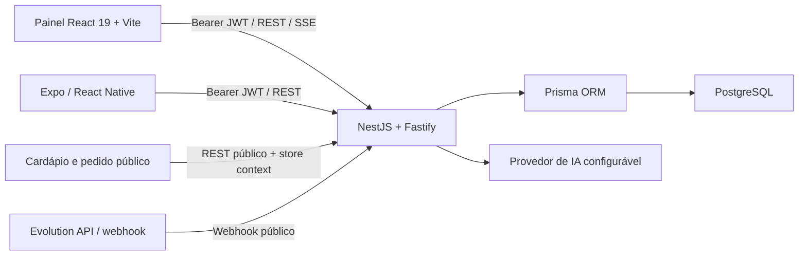
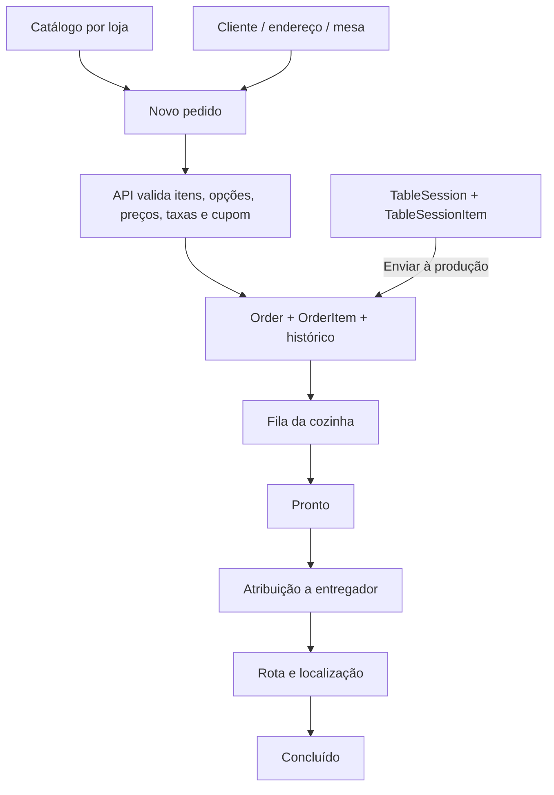

# Auditoria técnica — Cain Delivery

Data da auditoria: 14/07/2026  
Branch: `audit-ux-operational-redesign`  
Base auditada: `a01b2508a0387c99de781f410521208795a90f6a`

## Resumo executivo

O repositório contém três aplicações funcionais: painel web React, API NestJS e aplicativo Expo para entregadores. O fluxo principal funciona em ambiente local com PostgreSQL limpo: migrações, seed, autenticação, catálogo, pedidos, cozinha e estado do entregador foram exercitados. O código tem boa separação entre interface, serviços HTTP e backend; o backend recalcula preços e descontos no servidor, um acerto importante.

Os maiores riscos técnicos estão na modelagem operacional e nos limites de confiança. Um único `OrderStatus` representa aceite, preparo e entrega; salão mantém itens em `TableSessionItem` e só materializa um pedido ao enviar à produção. Isso cria duas representações operacionais do consumo. O número do pedido é calculado por contagem, atualizações de status não têm máquina de estados e várias mutações relacionadas não são transacionais. O produto ainda não possui testes automatizados, contrato de impressão ou workflow real de pagamento.

O redesign inicial deve permanecer na camada de apresentação: organizar pedidos em modos **Preparo** e **Expedição**, sem alterar enum, schema, contratos ou dados. As correções de domínio e segurança devem entrar em etapas separadas e revisáveis.

## Escopo e método

Foram lidos o README, o handoff do projeto, todos os blueprints em `docs/`, configurações, schema Prisma, controllers, services, guards, stores e os fluxos centrais do painel. Também foram executados builds, lint, validação Prisma, migrações e seed em banco local novo, smoke tests HTTP autenticados por papel, auditoria de dependências e inspeção visual em 1366×768 e 390×844.

Não foram usados serviços reais, dados de produção ou credenciais externas. Nenhuma migração destrutiva foi criada ou aplicada.

## Arquitetura encontrada

### Estrutura relevante

| Área | Local | Papel |
|---|---|---|
| Painel administrativo | `src/` | React 19, React Router, TanStack Query, Zustand, Tailwind/Radix |
| API | `apps/api/` | NestJS, Fastify, Prisma, Zod e JWT |
| App do entregador | `apps/driver-app/` | Expo/React Native |
| Banco | `apps/api/prisma/` | Schema, 18 migrações e seed |
| Integração WhatsApp | `infra/evolution-api/` | Docker Compose para Evolution API |
| Documentação | `docs/` | Blueprints técnicos/visuais e handoff |

Não há workspace npm formal: raiz, API e app possuem `package.json` e lockfile próprios. Também não há `engines`, `.nvmrc` ou `packageManager`, o que reduz a reprodutibilidade entre máquinas.

## Fluxo de dados do pedido

`Order` é o agregado central após confirmação, mas o salão usa um agregado próprio antes do envio. O mesmo enum `OrderStatus` controla etapas de equipes diferentes. `PaymentStatus` é separado, porém pagamentos não possuem confirmação de provedor, conciliação ou ledger próprio.

## Baseline reproduzível

Ambiente observado: Windows, Node `v24.16.0`, npm `11.13.0`, Git `2.54`; Docker não estava instalado. No PowerShell foi necessário usar `npm.cmd`, pois a política local bloqueia `npm.ps1`.

| Área | Comando | Resultado |
|---|---|---|
| Painel | `npm.cmd ci` | OK, 375 pacotes |
| Painel | `npm.cmd run build` | OK; alerta para chunks de 533 kB e 1,16 MB |
| Painel | `npm.cmd run lint` | OK com 4 avisos de React Compiler/hooks |
| API | `npm.cmd ci` | OK, 321 pacotes |
| API | `npm.cmd run prisma:generate` | Falha sem `DIRECT_URL`; OK após injeção local explícita |
| API | `npx.cmd prisma validate` | OK com `DATABASE_URL` e `DIRECT_URL` locais |
| API | `npx.cmd prisma migrate deploy` | 18 migrações aplicadas em banco novo |
| API | seed | OK após criar `.env` local ignorado; o script exige o arquivo mesmo com variáveis de processo |
| API | `npm.cmd run build` | OK após geração do Prisma Client |
| API | `npm.cmd run lint` | OK |
| Driver | `npm.cmd ci` | OK, 953 pacotes |
| Driver | typecheck, lint e export Android | OK; bundle HBC aproximado de 3,99 MB |
| Testes | busca por `*.test.*` / `*.spec.*` e scripts | Nenhum teste automatizado existente |

### Smoke tests da API

Com API em `127.0.0.1:3333` e banco PostgreSQL isolado:

- `GET /health`: 200;
- `GET /orders` sem token: 401;
- login inválido: 401;
- login e `GET /auth/me` como owner: 200;
- pedidos, cozinha, produtos e entregadores: respostas válidas com dados do seed;
- `GET /drivers/me/app-state` como driver: 200;
- `GET /orders` como driver: 403;
- `GET /drivers` como driver: **200**, exposição indevida detalhada em `SECURITY_AUDIT.md`.

## Dependências e desempenho

`npm audit` encontrou:

| Aplicação | Vulnerabilidades | Destaques |
|---|---:|---|
| Painel | 6 (1 baixa, 2 moderadas, 3 altas) | React Router e Vite |
| API | 6 (1 baixa, 2 moderadas, 3 altas) | Fastify, adapter Nest/Fastify e `fast-uri` |
| Driver | 18 (1 baixa, 14 moderadas, 2 altas, 1 crítica) | `shell-quote`, `undici`, `ws`; parte exige salto maior de Expo |

O build web sinaliza dois chunks acima do desejável. `DriverLocationPage` concentra mapa e lógica suficiente para gerar um chunk de aproximadamente 1,16 MB. O app do entregador exporta, mas sua árvore Expo possui o maior volume de avisos e deve ser atualizada em uma trilha própria, com teste em dispositivo.

## Achados técnicos priorizados

| Prioridade | Achado | Evidência/impacto | Recomendação | Esforço |
|---|---|---|---|---|
| P0 | Não há testes automatizados | Nenhum script ou arquivo de teste | Começar por funções puras de operação e regras de transição; depois integração API | M |
| P0 | Atualização de status sem máquina de estados | `orders.service.ts:updateStatus` aceita o destino sem validar origem | Definir transições por papel e usar transação | M |
| P0 | Numeração por `count + 1001` | Corrida e colisão após exclusão | Sequence/contador atômico por loja | M |
| P0 | Criação/repetição/status não são integralmente transacionais | Pedido, caixa, cupom e entregador podem divergir | Transações Prisma com idempotência | M/L |
| P0 | `repeatOrder` clona preço, desconto e pagamento históricos | Pode criar pedido pago com preço/cupom vencido | Recalcular como criação nova e nunca copiar estado de pagamento | M |
| P1 | Salão e pedido têm fontes paralelas antes da produção | `TableSessionItem` vira snapshot de `Order` | Declarar dono de cada estado e contrato de materialização idempotente | L |
| P1 | Um enum mistura preparo e entrega | Permissões e telas podem avançar etapas fora do papel | Introduzir state machine; separar kitchen/delivery em evolução compatível | L |
| P1 | Pagamento não é workflow confiável | Não há provedor, confirmação, conciliação ou endpoint dedicado | Modelar tentativa/evento de pagamento e webhook assinado | L |
| P1 | Impressão não é implementada | Botões recebem callbacks opcionais ausentes | Criar contrato de impressão, fila e reimpressão auditável | M |
| P1 | Falta configuração de runtime | Builds dependem do Node local | Declarar versão LTS e validar em CI | S |
| P1 | Prisma exige `.env` mesmo com variáveis de processo | Seed limpo falha até existir arquivo | Carregar `.env` opcionalmente | S |
| P2 | Stores mock legadas sem consumidores | `orders-store.ts` e `dining-store.ts` não são importadas | Remover após confirmação por cobertura/telemetria | S |
| P2 | Documentos divergem do código | Handoff marca cupons ausentes, mas endpoints existem; temas claro/escuro conflitam | Tornar docs versionadas por data/base e manter changelog | S |
| P2 | Chunks grandes | Piora primeira interação em hardware fraco | Separar mapa/providers e medir Web Vitals | M |
| P2 | Warnings de runtime em mapa/gráficos | OpenFreeMap devolveu 404 para glyphs `Open Sans Bold`; Recharts reportou contêiner -1×-1 durante navegação | Corrigir URL/font stack do mapa e dimensões mínimas antes do mount do chart | S/M |

## Pontos positivos a preservar

- Prisma aplica escopo de loja na maior parte dos serviços.
- Criação normal e pedido público recalculam preço, opções, disponibilidade, taxa, promoção e cupom no servidor.
- DTOs relevantes usam Zod e o `ValidationPipe` global remove propriedades desconhecidas.
- Erros 500 não devolvem stack ao cliente.
- O painel usa queries/mutations centralizadas e SSE para atualização de entregadores.
- Migrações existentes aplicam com sucesso em banco vazio.
- Os três artefatos compilam sem mudança de stack.

## Divergências entre documentação e implementação

- O handoff afirma que promoções/cupons ainda são pendentes, mas schema, controllers e telas já existem.
- O README contém caminhos absolutos de outra máquina.
- O blueprint administrativo descreve “Graphite & Sand” claro; o handoff e a aplicação atual usam shell escuro premium.
- A documentação sugere uma operação mais unificada, enquanto a navegação atual separa 23+ destinos e a Central de Pedidos exibe apenas três estados.
- Não existe evidência automática que sustente a afirmação histórica de build estável; a API falha em clone limpo quando `DIRECT_URL` não está definido.

## Direção técnica recomendada

1. Aplicar agora apenas uma composição visual compatível: modos Preparo/Expedição, cards informativos e mobile com uma fila por vez.
2. Corrigir em seguida os limites de autorização críticos e autenticar webhooks.
3. Criar state machine testada e transações/idempotência, mantendo os contratos externos compatíveis.
4. Introduzir pagamento e impressão como domínios explícitos, sem simular sucesso na interface.
5. Estabilizar CI, runtime LTS, testes e atualização controlada das dependências.

## Validação após o redesign inicial

| Verificação | Resultado final |
|---|---|
| `npm.cmd test` | 5/5 testes passaram, incluindo 500 itens sintéticos |
| painel `build` | OK; permanecem os dois chunks grandes documentados |
| painel `lint` | 0 erros; 4 warnings preexistentes no módulo de drivers |
| API `build` + `lint` | OK |
| driver `typecheck` + `lint` | OK |
| `git diff --check` | OK; apenas avisos locais de conversão LF/CRLF |
| portas locais 3333/5173/5432 | encerradas ao fim da auditoria |

O redesign não alterou API, schema Prisma, migrações ou seed. Os testes adicionados cobrem projeção dos modos, regra de SLA, ausência de previsão e limitação inicial de alta densidade.
