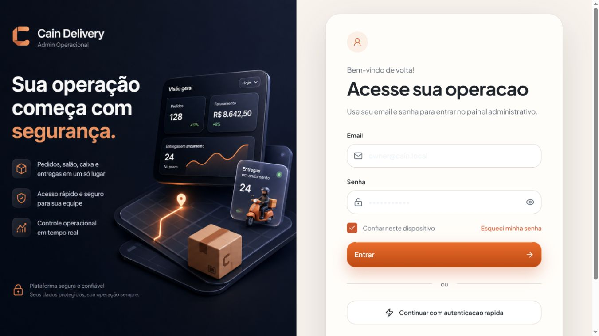
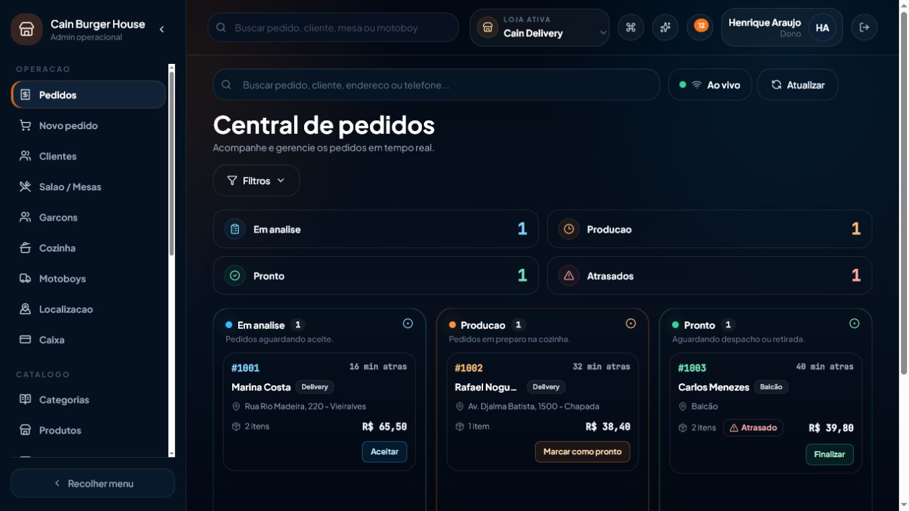
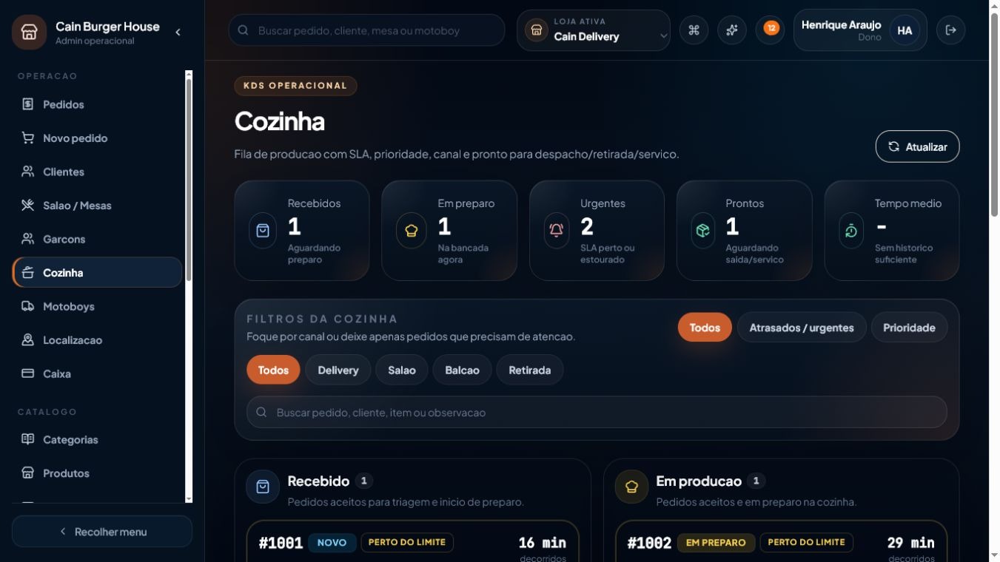
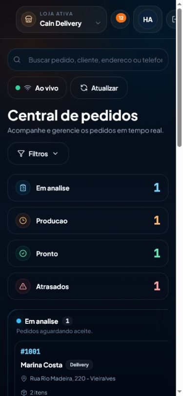
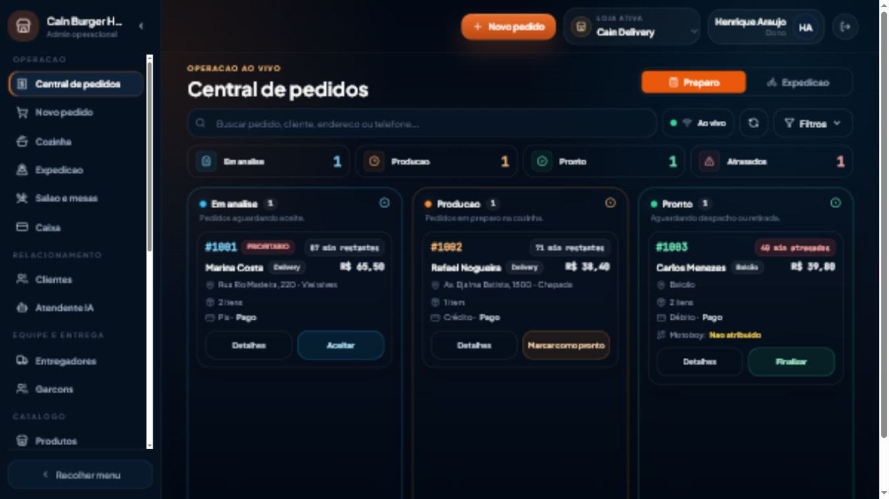
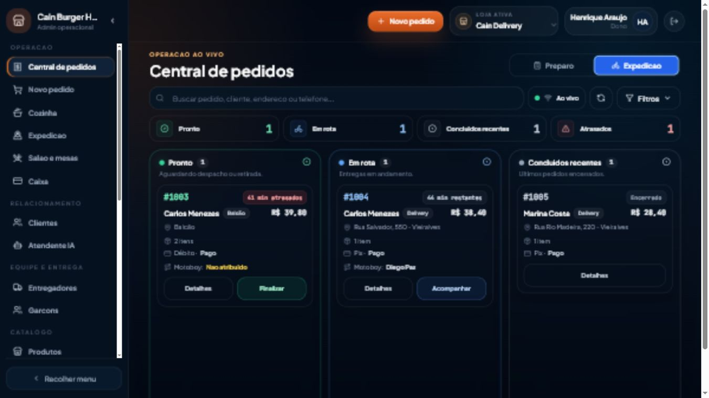
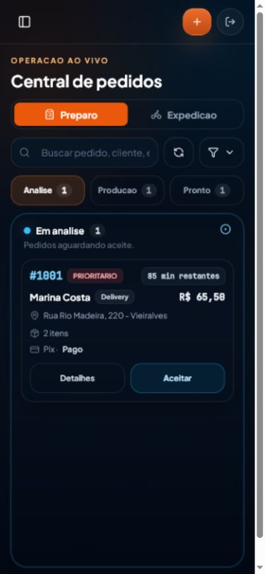
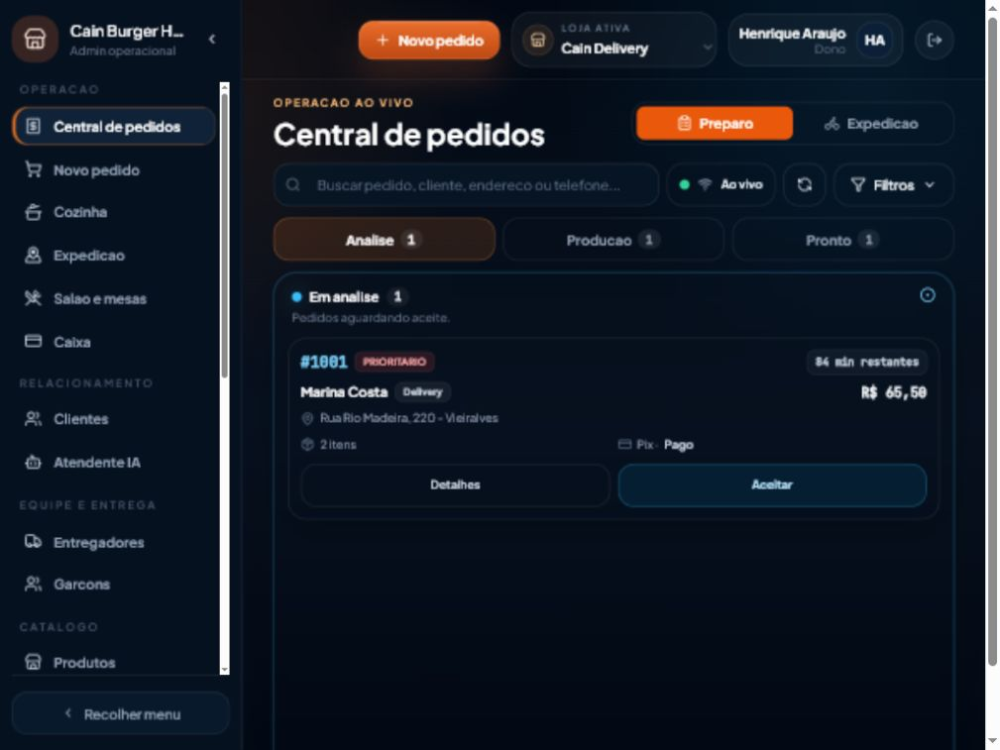

# Auditoria de UX — operação Cain Delivery

Data: 14/07/2026
Escopo principal: pedidos, cozinha, expedição e navegação operacional.

## Resumo executivo

A aplicação tem identidade visual consistente e muitos módulos funcionais, mas a tela operacional não prioriza o que uma equipe precisa decidir “agora”. Em desktop, navegação, header, resumo e filtros consomem grande parte do viewport. Em mobile, quatro cards de resumo empurram o primeiro pedido para fora da primeira dobra. A Central mostra apenas análise, produção e pronto; pedidos em rota desaparecem da central justamente quando a expedição precisa acompanhá-los.

O problema não é falta de dados. `Order` já contém pagamento, origem, SLA, observações, endereço, driver e timeline, mas o card resume quase tudo a cliente/endereço/itens/total. Ao mesmo tempo, o header ocupa espaço com busca global sem ação, botões sem ação e badge fixo. A cozinha exibe métricas e filtros demais antes da fila e permite ações de entrega, misturando responsabilidades.

A primeira melhoria recomendada é uma Central Operacional com dois modos, **Preparo** e **Expedição**, compartilhando o mesmo pedido e os mesmos endpoints. Desktop mantém três filas visíveis; mobile usa uma fila ativa por vez. Cards tornam pagamento, SLA, origem, observações e driver escaneáveis. Nenhum status ou regra do backend precisa mudar nessa etapa.

## Perfis e objetivos

| Perfil | Objetivo imediato | Frequência | Contexto típico |
|---|---|---:|---|
| Atendente/caixa | Registrar pedido correto e receber sem travar a fila | Muito alta | Desktop/tablet, interrupções frequentes |
| Cozinha | Saber o próximo preparo e sinalizar pronto | Contínua | KDS/tablet, distância visual, mãos ocupadas |
| Expedição | Separar prontos, atribuir driver e acompanhar rota | Contínua | Desktop/tablet/celular, alta pressão |
| Gerente/owner | Destravar exceções e observar gargalos | Média | Desktop e celular |
| Entregador | Ver apenas sua rota, atualizar localização e concluir entrega | Contínua | Celular, rede variável |

## Evidência visual “antes”

### Login — 1366×768



Credenciais demo vêm preenchidas, há uma ação de acesso rápido sem implementação e o rodapé afirma criptografia ponta a ponta sem evidência do mecanismo. “Lembrar dispositivo” não altera a persistência: o token sempre vai para `localStorage`.

### Central de pedidos — 1366×768



- sidebar de 280 px e com rolagem própria;
- busca global e busca local duplicadas; a global não executa ação;
- quatro cards de resumo ocupam uma linha inteira sem servir como filtro;
- somente três colunas; rota e concluídos ficam fora da Central;
- header contém comandos sem ação e notificação fixa “12”;
- card esconde pagamento, origem, notas e entregador;
- texto “N min atrás” é usado como atraso, mesmo sem comparar `dueAt`.

### Cozinha — 1366×768



Cinco métricas e um bloco grande de filtros ocupam quase toda a primeira dobra. A primeira tarefa aparece apenas no limite inferior do viewport. A tela inclui estados de rota/entrega e permite ações downstream, ampliando o escopo do KDS. O mesmo “SLA de preparo” é mostrado em itens já enviados ou entregues, onde perde significado.

### Central de pedidos — 390×844



O primeiro pedido fica abaixo da dobra após header, título, busca e quatro resumos empilhados. O board com largura mínima força navegação pouco evidente e não oferece seletor de fila otimizado para toque.

## Evidência visual “depois”

### Preparo — 1366×768



As três filas de preparo, SLA calculado por `dueAt`, forma/status de pagamento e ações de 44 px ficam na primeira dobra. O resumo virou filtro compacto no desktop.

### Expedição — 1366×768



Pronto, Em rota e Concluídos recentes agora formam uma projeção contínua. “Acompanhar” abre o mapa já com o entregador do pedido selecionado para perfis com `drivers:view`.

### Mobile — 390×844



O resumo redundante é ocultado e as três tabs cabem sem scroll horizontal. Só a fila ativa é renderizada; o primeiro card e suas ações aparecem na primeira dobra.

### Tablet — 1024×768



Com sidebar presente, o tablet preserva uma fila ampla por vez em vez de comprimir três cards. O operador alterna a etapa pelas tabs com contagem.

### Comparação observada

| Critério | Antes | Depois nesta branch |
|---|---|---|
| Estados na Central | análise, produção, pronto | + rota e concluídos via modo Expedição |
| SLA | idade sempre com “atrás” | restantes, atrasado apenas após `dueAt`, encerrado |
| Mobile 390×844 | primeiro card abaixo da dobra | primeiro card e ações na primeira dobra |
| Tablet 1024×768 | board largo/comprimido | uma fila ativa e ampla |
| Contexto | cliente, local, itens, total | + prioridade, origem, forma/status do pagamento, driver e nota |
| Tracking interno | troca manual de módulo e busca | um clique, respeitando `drivers:view` |
| Header | busca/command/IA/badge sem ação | controles falsos removidos; novo pedido e busca real contextual |

Foram exercitados no navegador: troca de modo, troca de tab mobile, acompanhamento em um clique, busca sem resultado, falha/retry sem API e acesso negado da cozinha à rota. Loading/refetch exibiu estado “Sincronizando”; a falha final exibiu mensagem segura e “Tentar novamente”.

## Heurísticas e achados

| ID | Prioridade | Heurística/tema | Problema | Consequência | Mudança proposta |
|---|---|---|---|---|---|
| UX-01 | P0 | Visibilidade do sistema | Central omite `out_for_delivery` e concluídos | Expedição perde continuidade e precisa trocar de módulo | Modos Preparo/Expedição na mesma Central |
| UX-02 | P0 | Hierarquia | Resumos/filtros precedem o trabalho | Pedidos ficam abaixo da dobra, sobretudo mobile/KDS | Resumo compacto, filtros progressivos, fila primeiro |
| UX-03 | P0 | Correspondência com o mundo real | “N min atrás” equivale visualmente a “atrasado” | Falso alarme; SLA perde credibilidade | Calcular `dueAt`: restantes, vence agora ou atrasado |
| UX-04 | P0 | Reconhecimento | Card omite forma/status do pagamento, origem, notas e driver | Operador abre detalhes ou decide com contexto incompleto | Linha operacional padronizada e alertas semânticos |
| UX-05 | P0 | Responsividade | Mobile mostra board largo/resumos empilhados | Trabalho essencial fora da dobra e alvo pequeno | Uma fila ativa, tabs de 44 px e card full-width |
| UX-06 | P1 | Controle | Cozinha consegue avançar estados de entrega | Erros de responsabilidade e transição | KDS limitado ao preparo; expedição em modo próprio |
| UX-07 | P1 | Consistência | Central, Cozinha e Detalhe usam composições diferentes para o mesmo pedido | Treinamento e leitura mais lentos | Card/tokens compartilhados por estado |
| UX-08 | P1 | Eficiência | 23+ destinos, nove só em Operação | Troca de contexto e rolagem lateral | Agrupar núcleo operacional; mover cadastros para grupos próprios |
| UX-09 | P1 | Honestidade da interface | Header tem ações inertes e badge fixo | Métricas falsas e perda de confiança | Remover ações até haver função; busca global real |
| UX-10 | P1 | Prevenção de erro | Ação primária de status é rápida, mas backend não valida transição | Duplo clique/corrida pode avançar errado | UI bloqueia pending; backend precisa state machine/idempotência |
| UX-11 | P1 | Recuperação | Corrigir pedido confirmado não tem fluxo | Operador cancela/refaz ou mantém erro | Edição protegida antes da produção, auditada |
| UX-12 | P1 | Completude | Registrar pagamento e reimprimir não são capacidades reais | Operador sai do sistema ou confia em botão sem efeito | Só mostrar após contrato server-side real |
| UX-13 | P2 | Acessibilidade | Botões de ícone sem nome, texto 10–11 px e ações h-8 | Leitor de tela e toque prejudicados | `aria-label`, mínimo 12–14 px operacional e alvo 44 px |
| UX-14 | P2 | Feedback | Loading/empty/error existem, mas não são uniformes entre módulos | Recuperação varia por tela | Componente compartilhado com retry e contexto |
| UX-15 | P2 | Consistência visual | Tokens claros no CSS, shell escuro hard-coded | Tema difícil de manter e contrastes inconsistentes | Tokens semânticos escuros documentados |

## Navegação atual

O grupo “Operação” mistura pedidos, novo pedido, clientes, salão, garçons, cozinha, motoboys, localização e caixa. Clientes e garçons são cadastros/equipe; não são destinos de monitoramento contínuo. Catálogo separa categorias e produtos em rotas de primeiro nível. Atendente IA está em outro grupo apesar de gerar demanda operacional.

Reorganização recomendada, mantendo rotas:

```text
Operação
├── Central de pedidos
├── Novo pedido
├── Cozinha
├── Expedição
├── Salão e mesas
└── Caixa

Relacionamento
├── Clientes
└── Atendente IA

Equipe e entrega
├── Entregadores
└── Garçons

Catálogo
└── Produtos e disponibilidade
```

O redesign inicial pode alterar rótulo/ordem e adicionar atalhos contextuais sem remover rotas existentes.

## Central de pedidos

### Estado atual

- query pede até 100 pedidos e filtra no cliente;
- três colunas fixas: análise, produção e pronto;
- filtros por busca/origem/status em popover;
- drawer contém dados mais completos e timeline;
- dispatch abre diálogo para escolher driver;
- cancelamento exige confirmação;
- SSE/invalidação atualiza dados em API mode.

### Proposta

**Modo Preparo:** Em análise → Em produção → Pronto.
**Modo Expedição:** Pronto → Em rota → Concluído recente.

O pedido pronto aparece em ambos os modos por ser o handoff entre equipes. Isso é uma projeção visual, não duplicação de dados. O modo deve permanecer no URL ou estado local previsível; em mobile, cada status vira tab com contagem.

Card operacional, em ordem de leitura:

1. número, prioridade e SLA real;
2. cliente + serviço/origem;
3. itens e observações críticas;
4. pagamento;
5. endereço/mesa ou driver;
6. ação primária do papel.

## Cozinha/KDS

O KDS deve responder três perguntas: **o que preparar agora, há quanto tempo/até quando e o que bloqueia o preparo?** Endereço completo, mapa, finalização de entrega e métricas históricas não devem competir com essas respostas.

Mudanças propostas em etapa posterior:

- no máximo três contadores compactos;
- filtros recolhidos, busca secundária;
- destaque para itens/modificadores/notas;
- ação “Iniciar”/“Pronto” com alvo ≥44 px;
- pedidos prontos saem do foco principal após confirmação do handoff;
- modo TV/KDS sem sidebar e com tipografia maior.

## Expedição

Hoje “Expedição” não existe como destino; as funções estão divididas entre coluna Pronto, Motoboys e Localização. O modo proposto deve tornar visíveis:

- prontos aguardando motorista;
- disponibilidade/carga do driver na atribuição;
- pedidos em rota com telefone/endereço minimizados na lista;
- atrasos/exceções e acompanhamento em um clique;
- concluídos recentes para confirmação, sem poluir a fila viva.

## Acessibilidade

Critérios para a primeira implementação:

- navegação completa por teclado e foco visível;
- botões de ícone com nome acessível;
- touch target mínimo de 44×44 px nas ações principais/mobile;
- status sempre com texto e não apenas cor;
- contraste AA para texto operacional;
- região viva apenas para atualizações importantes, evitando anunciar polling inteiro;
- ordem DOM igual à ordem visual;
- empty/error/retry com texto específico.

## Métricas de sucesso

| Métrica | Baseline observável | Alvo inicial |
|---|---|---|
| Primeiro pedido visível em 390×844 | Fora da primeira dobra | Dentro da primeira dobra |
| Estados operacionais visíveis na Central | 3 de 5 relevantes | 5 via dois modos |
| Contexto no card | cliente/endereço/itens/total | + pagamento, SLA, origem, nota, driver |
| Acompanhar pedido em rota | 2–3 ações e troca de módulo | 1 ação |
| Alvo das ações principais mobile | frequentemente 32 px | ≥44 px |
| Controles inertes/falsos no header | busca, comandos, badge fixo | zero |

## Limites do redesign inicial

Não serão simulados pagamento, impressão, alerta, WhatsApp ou edição de pedido. Não serão alterados schema, status, payloads ou regras de negócio. Recursos ausentes permanecem documentados e fora da UI até terem backend, autorização e auditoria reais.
