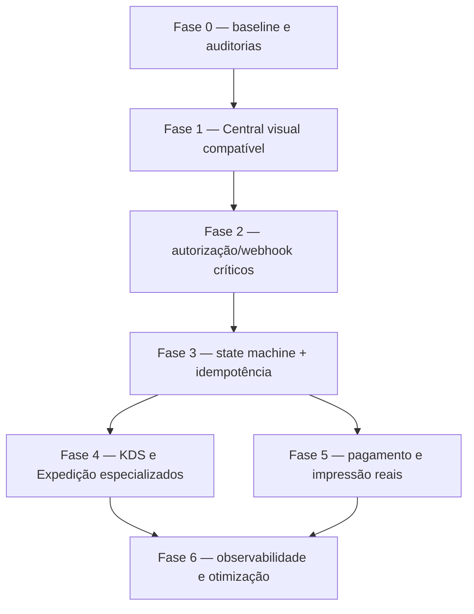

# Roadmap de implementação

Data: 14/07/2026  
Estratégia: lotes pequenos, compatíveis e reversíveis; segurança e domínio antes de expansão funcional.

## Sequência recomendada

## Fase 0 — baseline e documentação

Status: concluída nesta branch.

Entregas:

- builds/lint dos três projetos;
- Prisma validate, 18 migrações e seed em banco novo;
- smoke tests de auth/permissão/fluxos principais;
- auditoria de dependências e segredos;
- screenshots antes;
- sete documentos de auditoria/redesign.

Saída: baseline reproduzível e escopo sem alteração de contrato.

## Fase 1 — Central operacional compatível

Objetivo: ganho imediato sem alterar backend.

Status nesta branch: concluída e validada em 390×844, 1024×768 e 1366×768.

| Entrega | Arquivos prováveis | Risco | Verificação |
|---|---|---:|---|
| Funções puras de projeção/SLA | `src/features/orders/operations-board.ts` | Baixo | testes unitários |
| Modos Preparo/Expedição | `OrdersPage.tsx` e componentes | Baixo | status/contagens + visual |
| Mobile uma fila por vez | componentes do board | Baixo | 390×844 e 768×1024 |
| Card com contexto operacional | card/column | Baixo | dados ausentes e PII minimizada |
| Tracking em um clique | callback existente | Baixo | pedido em rota |
| Header honesto e busca real | `AppHeader.tsx` | Baixo | teclado, rota e filtros |
| Navegação compacta/agrupada | `navigation.ts`, `AppSidebar.tsx` | Baixo | permissões e rotas |
| Tokens semânticos | `globals.css` | Baixo | contraste e regressão visual |

Critérios de saída:

- nenhuma mudança Prisma/API;
- testes, build e lint passam;
- ações existentes preservam confirmação e permissões;
- screenshots depois em desktop/tablet/mobile;
- loading, empty, erro e alta densidade avaliados.

Rollback: reverter apenas componentes/tokens da Central; dados e contratos não mudam.

Resultado observado:

- 5 testes unitários de projeção/SLA/alta densidade passaram; a fila inicial limita renderização a 6 itens e expande sob demanda em um conjunto sintético de 500;
- build passou e lint permaneceu sem erros, com os 4 warnings preexistentes de drivers;
- empty, loading/refetch e erro/retry foram exercitados;
- owner acompanhou pedido em rota em um clique;
- cozinha viu apenas “Detalhes” no pedido em rota e recebeu acesso bloqueado em `/drivers/location`;
- nenhuma migração, endpoint ou payload foi alterado.

## Fase 2 — bloqueios críticos de segurança

Deve ser PR separado da UI.

### 2.1 Driver self versus administração

- criar permissões distintas (`drivers:self`, `drivers:dispatch`, `drivers:manage` ou equivalentes);
- endpoints `/me/*` derivam `driverId` do usuário autenticado;
- `/drivers/:id/location` exige papel administrativo/dispatcher;
- minimizar mapper conforme papel;
- testes negativos por papel e loja.

### 2.2 Webhook confiável

- capturar corpo bruto para validar assinatura HMAC;
- segredo obrigatório por ambiente;
- timestamp com janela curta;
- unique key para external event/message ID;
- replay retorna o resultado anterior sem efeito colateral;
- rate limit/fila e testes com assinatura inválida/expirada/repetida.

Critério de saída: os dois testes exploratórios que hoje falham passam; deploy pode negar webhook legado somente após configurar o provedor.

## Fase 3 — integridade do domínio

### State machine

Definir transições por estado/papel, por exemplo:

| Origem | Destino permitido | Papel/capacidade | Pré-condição |
|---|---|---|---|
| Em análise | Em produção | atendimento/cozinha | pedido válido |
| Em produção | Pronto | cozinha | itens enviados |
| Pronto | Em rota | expedição | driver válido/disponível |
| Pronto | Concluído | atendimento | retirada/mesa |
| Em rota | Concluído | driver próprio/expedição | assignment ativo |
| estados permitidos | Cancelado | papel específico | motivo + política financeira |

- ator vem do request context;
- versão/estado atual entra no `WHERE` para concorrência;
- histórico/audit log append-only;
- regras cobertas por tabela de testes.

### Transação e idempotência

- criação: número + pedido + itens + cupom + caixa numa transação;
- dispatch: assignment + status + disponibilidade numa transação;
- sequence/contador atômico por loja;
- idempotency key em create/repeat/status/payment/webhook;
- `repeatOrder` chama o pipeline de criação atual e inicia pagamento pendente.

Compatibilidade: introduzir headers/campos opcionais primeiro; exigir após clientes adotarem.

## Fase 4 — KDS e Expedição especializados

Dependência: fases 2 e 3.

### KDS

- apenas análise/produção/pronto;
- itens/modificadores/notas dominantes;
- métricas compactas abaixo/fora da fila;
- modo TV;
- transições restritas e feedback idempotente.

### Expedição

- atribuição com carga, disponibilidade e ETA;
- prontos, rota e exceções;
- tracking interno com PII mínima;
- handoff/saída distintos se a operação exigir;
- SSE resiliente com estado de conexão.

Testar com 0, 1, 20, 100 e 500 pedidos sintéticos sem usar produção.

## Fase 5 — capacidades ausentes

### Pagamento

- `PaymentAttempt`/eventos imutáveis;
- status pendente até confirmação;
- webhook assinado e idempotente;
- conciliação, estorno e permissão manual;
- UI deixa claro “aguardando”, “confirmado”, “falhou” e “estornado”.

### Impressão

- template versionado e payload server-side;
- fila/job com destino e status;
- impressão e reimpressão auditadas;
- fallback/download apenas se autorizado;
- botões só aparecem com capability real.

### Edição de pedido

- janela por estado;
- recalcular valores no servidor;
- tratar pagamento/cupom/estoque;
- versionamento e before/after.

## Fase 6 — plataforma e desempenho

- runtime Node LTS declarado e CI para três projetos;
- testes unitários, integração com Postgres e E2E por papel;
- atualizar Fastify/React Router/Vite e trilha Expo controlada;
- dividir chunk do mapa e medir Web Vitals;
- logs estruturados/correlation ID, métricas e alertas sem PII;
- SCA, secret scan, SBOM e imagem Evolution fixada por digest;
- política de backup/restore testada.

## Matriz de testes mínima

| Camada | Casos |
|---|---|
| Unidade | SLA, projeção de colunas, state machine, cálculo monetário |
| Integração API | auth, tenant, create/repeat/status, concorrência, idempotência, webhook |
| Contrato | painel/driver versus DTOs e erros |
| E2E | owner, atendente, cozinha, expedição, driver e acesso negado |
| Visual | 390, 768, 1024, 1366; empty/loading/error/densidade |
| Segurança | IDOR, cross-tenant, replay, brute force, token revogado, tracking |
| Resiliência | timeout do provedor, SSE desconectado, retry, DB conflito |

## Riscos e mitigação

| Risco | Probabilidade/impacto | Mitigação |
|---|---|---|
| UI torna capacidade insegura mais fácil de achar | Média/Alta | não ampliar permissão; destacar backlog P0; separar PR de segurança |
| Mudança de status quebra clientes antigos | Média/Alta | state machine compatível, feature flag e telemetria de rejeição |
| Idempotência causa colisão entre lojas | Baixa/Alta | chave composta por loja + operação + ator; TTL/persistência definida |
| Upgrade Expo quebra dispositivo | Alta/Média | branch própria, build nativo e teste em hardware |
| KDS denso degrada em tablet | Média/Média | orçamento de render e dados sintéticos de alta densidade |
| Nova arquitetura de pagamento vira fonte paralela | Média/Alta | ledger/evento como fonte única e migração explícita |
| PII em logs/analytics | Média/Alta | allowlist de campos e revisão de privacidade |

## Estratégia de commits/PRs

Sugestão de commits desta primeira entrega:

1. `docs(audit): registrar baseline técnico, segurança e fluxos atuais`
2. `docs(ux): definir redesign, design system e roadmap`
3. `test(orders): cobrir projeções operacionais e SLA`
4. `feat(orders): adicionar modos preparo e expedição responsivos`
5. `refactor(shell): compactar navegação e remover controles inertes`
6. `docs(audit): adicionar evidências visuais e resultados finais`

Segurança crítica deve usar PR separado, com commits para testes de exploração primeiro e correção depois. Não misturar atualização massiva de dependências com mudança funcional.

## Definition of Done global

- requisito e ameaça documentados;
- regra relevante executada no servidor;
- testes positivos, negativos e de autorização;
- migração compatível e rollback quando houver banco;
- sem segredo/PII em código, log, fixture ou screenshot;
- build/lint/SCA avaliados;
- responsividade e acessibilidade verificadas;
- documentação e evidências atualizadas na mesma base.

## Hardening crítico concluído em branch separada

Em `security/critical-operational-hardening` foram implementados: autorização self/admin de drivers, webhook autenticado e deduplicado, máquina de estados server-side, repetição reprecificada, rate limiting contextual, idempotência persistida e confirmação manual de pagamento auditada. A migration é aditiva; testes unitários e de integração PostgreSQL foram incluídos.

Itens deliberadamente fora desta etapa: WhatsApp Cloud API oficial, agente novo, impressão, app novo do garçom, gateway novo de pagamento, rate limit distribuído, revogação JWT e tracking público tokenizado.
