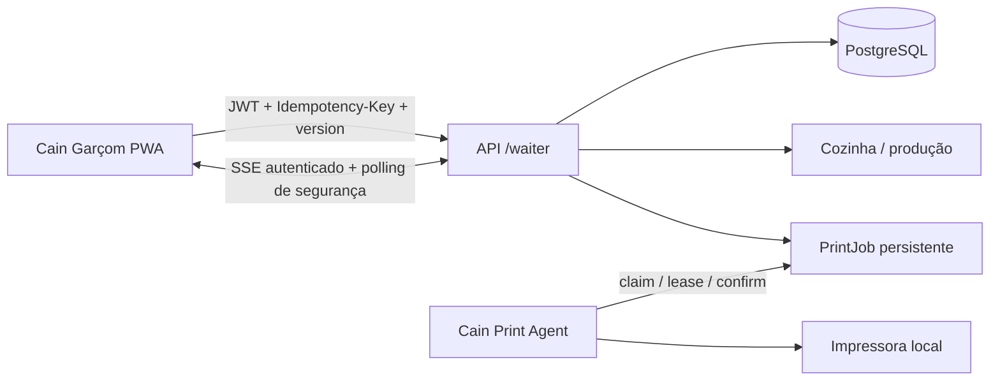

# Arquitetura do Cain Garçom

## Objetivo e limites

`apps/waiter-app` é uma PWA React independente, feita para salão e tablet. Ela não acessa Prisma, impressoras ou serviços de terceiros: toda decisão definitiva passa pela API NestJS e pelo tenant extraído do JWT.

## Estrutura

- `apps/waiter-app/src/app`: shell, roteamento, sessão e providers.
- `apps/waiter-app/src/features`: login, mesas e comanda.
- `apps/waiter-app/src/lib`: cliente HTTP/SSE, cache, rascunho e métricas locais.
- `apps/waiter-app/public`: manifesto, ícone provisório e service worker.
- `apps/api/src/modules/waiter`: contrato mínimo, guard de usuário ativo e orquestração.
- `apps/api/src/modules/dining`: fonte da verdade da sessão, itens, versões e total.

## Contrato HTTP

Leituras: `GET /waiter/bootstrap`, `/profile`, `/tables`, `/tables/:id`, `/menu` e `/stream`. Escritas: abrir sessão, enviar itens, cancelar item, marcar entrega, solicitar fechamento e transferir mesa. O browser nunca informa preço aceito; envia produto, opções, observação, quantidade e versões conhecidas.

Todas as escritas exigem autenticação, permissão, loja, usuário ativo, chave idempotente e versão otimista. O garçom opera apenas a própria sessão; gerente pode atuar em qualquer sessão da loja.

## Estado e sincronização

- TanStack Query mantém somente cache de leitura.
- Token fica em memória e `sessionStorage`; senha nunca é persistida.
- O rascunho local é separado por loja, usuário e mesa, expira em 8 horas e nunca equivale a pedido aceito.
- SSE invalida mesas, catálogo e sessão; polling de 45 segundos é a rede de segurança.
- Perda de conexão mantém a última leitura e o rascunho, mas bloqueia todas as mutações.
- Conflito HTTP preserva o rascunho, refaz a leitura e exige confirmação humana.

## Integração operacional

O primeiro envio gera pedido de produção e evento `ORDER_INITIAL`; envios posteriores contêm somente a adição e geram `ORDER_ADDITION`. Cancelamento enviado registra ator/motivo e gera `ORDER_REMOVAL`. O status de produção volta pela mesma sessão; item pronto pode ser entregue pelo garçom. Solicitar fechamento não registra pagamento nem libera a mesa.
